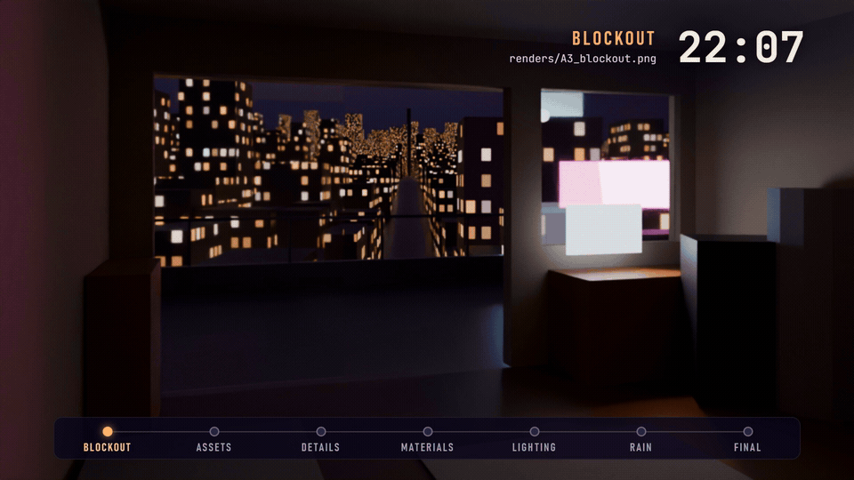

# claude-3d-harness

Build Blender scenes with Claude Code using five community skill libraries, through one registry and one MCP
server.

<!--
  VIDEO PLACEHOLDER
  On github.com, open this README in the web editor and drag brag-output/brag-github.mp4 (4.9 MB; free plans accept
  videos up to 10 MB) onto the empty line below this comment. GitHub uploads it and inserts a
  https://github.com/user-attachments/assets/... line, which renders as an inline player. Then delete this comment.
-->


<p align="center"><sub>
The first cinematic job run through the harness, from a grey blockout at 22:07 to the final frame at 01:37, in Blender
5.2.2 with Cycles. The renders are stills; the moving rain was added in the edit. 23 seconds, sound on.
</sub></p>

The Blender skill libraries on GitHub were each written to be installed on their own. Installed together they
conflict: they target different MCP servers, two ship a skill with the same name, and some open their own socket to
Blender. This repository keeps them upstream, pinned as git submodules, and adds the layer that lets Claude Code use
them together:

- a registry that routes every capability to exactly one skill, with fallbacks;
- translation tables for the MCP tool names each library was written against;
- profiles (`fast`, `standard`, `cinematic`) that scale planning, checkpoints and render budgets to the job;
- workflows that put the stages in order, with a render checkpoint at each gate.

It contains no 3D skills of its own.

[Quick start](#quick-start) · [How it works](#how-it-works) · [A real job](#a-real-job-stage-by-stage) ·
[Upstreams](#whats-composed) · [Status](#status)

## Quick start

You need Windows (tested on 11), [Git](https://git-scm.com/download/win),
[uv](https://docs.astral.sh/uv/getting-started/installation/), [Blender](https://www.blender.org/download/) 4.2 or
newer, and Claude Code. `ffmpeg` (camera-move videos) and `node` (some product helpers under the fallback MCP
provider) are optional.

Clone to a short path. Git on Windows cannot create the submodule directories when the repository root is deeper than
about 150 characters.

```powershell
git clone https://github.com/MAX-786/claude-3d-harness.git C:\dev\claude-3d-harness
cd C:\dev\claude-3d-harness
.\scripts\install.ps1
```

`install.ps1` checks out the five upstreams at their pinned commits and writes `.mcp.json`. It downloads the MCP
provider's Blender extension from its pinned GitHub release, checks it against the SHA-256 recorded in
`registry/mcp.yaml`, and installs it into every Blender it finds. It finishes with `doctor` and `verify`. Useful
switches: `-BlenderPath` for a Blender in an unusual place, `-SkipBlenderExtension` to leave Blender alone, and
`-Mcp ahujasid` for the fallback server.

Then:

1. Start Blender, press `N` in the 3D View and open the **BlenderMCP** tab.
2. Open Claude Code in the repository folder and approve the `blender` MCP server when asked.
3. Describe what you want, for example:

   > Create a photorealistic interior of a traditional Japanese room during heavy rain. The camera slowly moves
   > toward the window. Use free online assets where they help, build the rest, render a preview, inspect it and
   > refine until the composition and lighting hold together.

Every job gets its own folder under `output/` (git-ignored) holding the plan, checkpoint renders, final images and a
report.

**macOS and Linux** run the same steps through the engine. Neither has been tested yet.

```bash
git clone https://github.com/MAX-786/claude-3d-harness.git && cd claude-3d-harness
uv run scripts/harness.py bootstrap
uv run scripts/harness.py mcp-config --write
uv run scripts/harness.py install-extension
uv run scripts/harness.py doctor
uv run scripts/harness.py verify
```

A ZIP download from GitHub contains no submodules. `bootstrap` (and therefore `install.ps1`) handles that case: it
initialises git and adds each upstream at the commit recorded in `registry/upstreams.yaml`.

## How it works

```text
             Claude Code
                  |
   CLAUDE.md + blender-harness skill        the only skill Claude Code loads up front
                  |
   classify: fast / standard / cinematic -> choose a workflow
                  |
   scripts/harness.py resolve               registry -> ordered load plan
                  |
   upstream/<repo>/.../SKILL.md             read on demand, one stage at a time
                  |
   MCP server "blender"  ->  Blender        build, render a checkpoint, inspect, refine
```

1. **Classify.** The entry skill decides how much effort the job deserves. One object is `fast`; a composed still
   with a few objects is `standard`; an environment with weather, night or a named lens is `cinematic`. The rules and
   worked examples are in [orchestrator/task-classifier.md](orchestrator/task-classifier.md).
2. **Choose a workflow:** `modeling`, `product`, `photography`, `animation`, `environment` or `cinematic`.
3. **Resolve.** The registry turns workflow and profile into a load plan: which upstream skill to read for each
   stage, in order, with the profile's budgets, the optional stages and when they apply, fallbacks, and the
   adjustments each skill needs under the harness.
4. **Build stage by stage.** Each SKILL.md is read just before its stage; several run past a thousand lines. Every
   tool call goes to the single server named `blender`.
5. **Check.** The profile sets when to render a checkpoint and how many fix passes the job may spend. A defect that
   survives two passes escalates to a refinement skill instead of a third guess
   ([orchestrator/qa-loop.md](orchestrator/qa-loop.md)).

The load plan is plain text, and you can read it before anything touches Blender (abridged):

```text
$ uv run scripts/harness.py resolve -w cinematic -p cinematic
LOAD PLAN  workflow=cinematic  profile=cinematic  mcp=newo-ether  tools=mcp__blender__<tool>

BUDGETS
  checkpoints: screenshot or preview render at every stage gate
  refinement_passes: 4
  final: 1920x1080 or above, Cycles at 512 samples or fewer with denoise; render animation only after the still is approved

LOAD IN ORDER (read each SKILL.md just before its stage, not all up front)
   1. [always] mcp-usage -> newo/blender-mcp
      upstream/newo-blender-mcp/skills/blender-mcp/SKILL.md
   2. [always] execution-core -> cc/text-to-blender
      upstream/cc-blender-skill/plugin/skills/text-to-blender/SKILL.md
   ...
  12. [lighting] lighting -> cc/blender-lighting
      upstream/cc-blender-skill/plugin/skills/blender-lighting/SKILL.md
      stage note: Includes atmosphere - volumetrics, practicals, motivated sources.
   ...

FALLBACKS (only if the chosen skill is missing or has failed twice on the same defect)
  lighting: gaius/blender-lighting (upstream/blender-claude-mcp/skill/blender-lighting/SKILL.md)
  ...
```

More ways to call it:

```powershell
uv run scripts/harness.py resolve -w product -p standard --variant camera-animation=perfect-loop
uv run scripts/harness.py resolve -w modeling -p fast --add architecture
uv run scripts/harness.py resolve -c materials lighting -p fast    # an edit to an existing scene
uv run scripts/harness.py list capabilities
```

### Why a registry and not a folder of skills

These problems turned up while cataloging the libraries:

- **Three MCP servers.** Most skills were written for the original `ahujasid/blender-mcp`, one library for a
  connector registered as `Blender` with a different tool surface, and the newo-ether usage skill for tools only that
  fork has. `registry/mcp.yaml` keeps a translation table per upstream, and the load plan prints it next to the
  skills that need it.
- **Name collisions.** Two libraries ship `blender-lighting`, and one ships duplicate copies of its own skills. The
  registry namespaces them (`cc/blender-lighting`, `gaius/blender-lighting`), routes one and keeps the other as a
  fallback.
- **Skills that bypass MCP.** Seven bundle Node scripts that open the Blender add-on socket themselves. They are
  marked `direct-socket`: Claude takes their parameters and step order and performs the steps through MCP.
- **Skills that must not run here.** One needs its own WebSocket add-on, a second execution path next to the MCP
  server, so it is excluded. One rewrites skill files and cuts releases as part of its loop; it carries a note, and
  `upstream/` is edit-denied in `.claude/settings.json`.
- **Context cost.** Only the entry skill is registered with Claude Code. Everything else is read on demand, a stage at
  a time.

## A real job, stage by stage

The rooftop study in the demo was the first `cinematic` job run through the harness, on Windows 11 with Blender 5.2.2
LTS, newo-ether v1.18.0 and an RTX 3050 Laptop GPU. The shot: a small room on a rooftop in a Japanese city at night in
light rain, a desk with a monitor showing code, a half-open sliding door onto the wet roof, and the city falling away
into haze.

<p align="center">
  
</p>
<p align="center"><sub>
Each frame is a stage checkpoint, labelled with the time its file was written. The moving rain on the last frame was
added in the edit.
</sub></p>

The job started at 21:52. Claude Code rendered and inspected a checkpoint at every stage gate:

| Stage | Checkpoint | Written |
| --- | --- | --- |
| Blockout | `A3_blockout.png` | 22:07 |
| Primary assets | `B6_primary.png` | 22:30 |
| Secondary details | `C6_secondary.png` | 23:02 |
| Materials | `D3_materials_gate.png` | 00:52 |
| Lighting | `E5_lighting.png` | 00:58 |
| Rain and atmosphere | `F6_rain_gate.png` | 01:12 |
| Final | `final_1920x1080.png` | 01:37 |

From the job's report:

- 449 mesh objects, about 724,000 triangles before instancing, 51,545 instances.
- A procedural city of 16,685 building volumes, and about 41,000 rain streaks from one Geometry Nodes tree.
- 12 Poly Haven models and 7 texture sets, all CC0 and each recorded with its URL. The posters, neon signs and monitor
  screen are original artwork generated by scripts inside the job.
- 24 node graphs (20 materials, the world, two Geometry Nodes trees and the compositor) written as validated patches
  through the server's structured node tools rather than raw Python.
- Final frame: 1920×1080, Cycles, 400 samples, 7 min 9 s on CUDA.

Some of what the checkpoints caught:

- The walnut desk read grey, because the CC0 texture set is grey-toned. Fixed by mapping the grain through a walnut
  colour ramp.
- The desk lamp's light was blocked by its own bulb mesh. Fixed by turning off shadow casting on the bulbs.
- A colour-balance grade turned the frame violet and banded. Fixed by cutting the grade factor to 0.3.

And what did not work: OptiX failed to compile on the installed NVIDIA driver (566.07; Blender 5.2 needs 575 or newer),
so the job rendered on CUDA. Light linking set from Python was not honoured, so spill light was controlled by aiming
and ray visibility instead. The overhead street wires are too thin to read at 1080p. These are recorded in
[notes/lessons.md](notes/lessons.md), together with the MCP quirks found along the way.

## Profiles and workflows

Profiles live in `registry/profiles.yaml`. They decide which stages run (stages carry a `min_profile`) and how much
iteration a job may spend.

| Profile | For | Plan | Checkpoints | Fix passes | Final render |
| --- | --- | --- | --- | --- | --- |
| `fast` | One simple object or a small edit | 3-5 lines in chat | One viewport screenshot | 1 | Up to 1280×720, 64 samples or fewer |
| `standard` | Several objects, real materials and light | `plan.md` with acceptance criteria | After block-out, lighting, materials | 2 | Up to 1920×1080, 256 samples or fewer |
| `cinematic` | Environment, atmosphere, camera motion | Shot description, references, assets, gates, risks | Every stage gate; a contact sheet before any animation render | 4 | 1920×1080 or above, 512 samples or fewer |

Workflows live in `workflows/*.yaml`, one per job type:

| Workflow | Use when |
| --- | --- |
| `modeling` | The object itself is the deliverable: an asset, prop or part |
| `product` | One product presented for sale: packshot, hero still, optional spin |
| `photography` | The request is phrased photographically, or an existing scene needs to be shot well |
| `animation` | Motion is the deliverable: object animation, camera move, loop |
| `environment` | A place with many objects, delivered as a still |
| `cinematic` | Environment plus atmosphere plus a graded final frame, usually with camera motion |

## What's composed

| Key | Upstream | License | SKILL.md files | Role here |
| --- | --- | --- | --- | --- |
| `cc` | [RobLe3/cc-blender-skill](https://github.com/RobLe3/cc-blender-skill) | MIT | 31 | Primary library: execution conventions, modeling, materials, lighting, cameras, rendering, animation, export, reference-locked reconstruction, refinement loop |
| `gaius` | [Gaius114/blender-claude-mcp](https://github.com/Gaius114/blender-claude-mcp) | MIT | 12 | Specialists the primary lacks: architecture, procedural modeling, geometry nodes, sculpting, rigging, physics, spatial layout, research. The skill text is in Italian; for seven of these capabilities it is the only provider. |
| `kb` | [kevinbadi/blender-skills](https://github.com/kevinbadi/blender-skills) | none | 16 | Product camera moves, Poly Haven studio helpers, photo-to-3D |
| `jo` | [jithinolickal/blender](https://github.com/jithinolickal/blender) | Apache-2.0 | 1 | Parametric design workflow |
| `newo` | [newo-ether/blender-mcp](https://github.com/newo-ether/blender-mcp) | MIT | 1 | The MCP server (pinned release v1.18.0) and its usage skill |

All 61 SKILL.md files are cataloged in `registry/skills.yaml`: 45 routable, 13 loaded only through a parent skill, and
3 excluded (two duplicates, and the one that needs its own Blender bridge). `verify` fails when an entry points at a
missing file and warns when an upstream ships a SKILL.md the catalog does not know. `uv run scripts/harness.py list
skills` prints the full table.

## The MCP layer

Exactly one server, always named `blender`, generated into `.mcp.json` from `registry/mcp.yaml`.

| Provider | What | When |
| --- | --- | --- |
| `newo-ether` (default) | A fork of the original server that keeps its tool names and adds structured node editing, Blender documentation search and multi-instance claiming. Runs through `uvx` from the pinned v1.18.0 wheel. | Blender 4.2 and newer |
| `ahujasid` | The original ([ahujasid/mcp-for-blender](https://github.com/ahujasid/mcp-for-blender), `blender-mcp==2.0.0`), which every skill library was validated against | Fallback: `.\scripts\install.ps1 -Mcp ahujasid`, then install its `addon.py` by hand |

Telemetry is switched off in the generated config (`DISABLE_TELEMETRY=true`). `.claude/settings.json` pre-allows the
read-only MCP tools and the harness script; `execute_blender_code`, which runs arbitrary Python inside Blender, still
asks each time unless you choose "always allow". If you also run the fork's own installer, pass its
`-SkipClaudeCodeRegistration`, `-SkipCodexRegistration`, `-SkipClaudeDesktop` and `-SkipSkillInstallation` switches;
otherwise a second server named `blender_mcp` competes for the same Blender. `doctor` warns about user-scope duplicates.

## Pinning and updates

Upstream skills are instructions Claude follows with code-execution rights inside Blender, so changes to them are
reviewed rather than pulled in automatically.

- Each upstream is a submodule at a reviewed commit (`cataloged_at` in `registry/upstreams.yaml`).
- The MCP server and its Blender extension are pinned to one release. The extension is checked against the SHA-256 in
  `registry/mcp.yaml` before it is installed; the server wheel's SHA-256 is recorded there as well.
- `update` moves upstreams to their branch tips and stages nothing. It prints a GitHub compare link per upstream,
  reports catalog drift, and audits the changed files for network calls, shell or dynamic execution, credentials,
  agent-config tampering, installs and destructive file operations. The flags prompt a human review; they are not
  verdicts.
- `upstream/` is edit-denied. Lessons that a skill would normally write back into its own files go to
  `notes/lessons.md`.

```powershell
.\scripts\update.ps1 -Only cc                  # move one upstream to its branch tip and audit the diff
uv run scripts/harness.py catalog-bump cc      # accept the new commit
git add registry upstream/cc-blender-skill
git commit -m "Bump cc-blender-skill"
.\scripts\update.ps1 -Rollback                 # or return to the pinned commits
```

## Commands

Everything runs through `uv run scripts/harness.py <command>`. Its only dependency, PyYAML, is resolved by `uv`.

| Command | What it does |
| --- | --- |
| `doctor` | Checks git, uv, optional tools, path length, Blender and its extension, submodules, `.mcp.json`, duplicate user-scope Blender servers, and whether the add-on is listening on `127.0.0.1:9876` |
| `bootstrap` | Checks out every upstream at its pinned commit, including from a ZIP download |
| `verify` | Validates the registry against the upstream trees |
| `resolve` | Prints the load plan (`-w`, `-p`, `-c`, `--add`, `--variant`, `--json`) |
| `list` | Prints upstreams, skills, capabilities, workflows or profiles |
| `where <name>` | Finds every skill with a given bare name |
| `mcp-config` | Renders `.mcp.json` from `registry/mcp.yaml` (`--provider`, `--write`) |
| `install-extension` | Downloads, checksums and installs the active provider's Blender extension (`--blender <path>`) |
| `update` | Moves upstreams forward, then verifies and audits what changed (`--rollback`) |
| `audit` | Flags risky patterns in upstream files (`--since-cataloged`, `-v`) |
| `catalog-bump` | Records the checked-out commit as reviewed |

`scripts/install.ps1`, `update.ps1` and `verify.ps1` are thin Windows wrappers around these.

## Layout

```text
.claude/skills/blender-harness/   the entry-point skill
.claude/settings.json             read-only MCP tools allowed, upstream/ edit-denied
.mcp.json                         generated: one server named "blender"
CLAUDE.md                         always-on instructions for Claude
registry/                         upstreams, skills, capabilities, profiles, mcp
workflows/                        six job types as ordered stages
orchestrator/                     classifier, workflow and skill selection, QA loop
scripts/                          harness.py engine and the install / update / verify wrappers
upstream/                         the submodules (read-only)
notes/lessons.md                  lessons from real jobs
docs/media/                       the stage-render GIF used in this README
output/                           job folders: plans, checkpoints, renders, reports (git-ignored)
```

## Status

Early, and so far used on one machine.

Verified:

- Setup on Windows 11 with Blender 5.2.2 LTS and newo-ether v1.18.0: submodules, `.mcp.json` and the Blender
  extension are in place and `doctor` passes every check. That includes a Blender installed at a drive root, which is
  found through the Windows uninstall registry.
- `verify` reports 0 failures and 0 warnings against the pinned commits, and the `resolve` and `list` examples in this
  README run as shown.
- Two jobs end to end: a `fast` single object (a wooden table) and the `cinematic` rooftop study above.

Not exercised yet:

- macOS and Linux.
- The `ahujasid` fallback provider in a live session.
- Animation: camera moves, contact sheets and frame-range renders.
- Bootstrapping from a ZIP download.

## Contributing

Issues and pull requests are welcome. Most changes are data:

| Task | Where |
| --- | --- |
| Prefer another skill for a capability | Swap `provider` and `fallbacks` in `registry/capabilities.yaml` |
| Handle a new upstream skill | Add it to `registry/skills.yaml` as `active`, `chained` or `excluded` |
| Add an upstream library | `git submodule add`, then an entry in `registry/upstreams.yaml` with its dialect, catalog and routes |
| Pin a newer MCP release | Update `release`, the URLs and both SHA-256 values in `registry/mcp.yaml`, then `harness.py mcp-config --write` |

Run `uv run scripts/harness.py verify` before opening a pull request. Fixes to a skill's content belong in that
skill's own repository. If a skill misbehaves in a real job, an entry in `notes/lessons.md` (date, job, what failed,
what fixed it, which skill) is one of the most useful contributions.

## Credits

The 3D skills are the work of their authors: RobLe3 (cc-blender-skill), Gaius114 (blender-claude-mcp), kevinbadi
(blender-skills), jithinolickal (blender) and newo-ether (blender-mcp, a fork of ahujasid's original server). This
repository only routes between them.

The rooftop study uses CC0 models and textures from [Poly Haven](https://polyhaven.com). In the demo video, the music
is by Sascha Ende at [ende.app](https://ende.app) ("Happy Beats / Business Moves", vol. 12, CC BY 4.0) and the sound
effects are CC0 by Kenney and unicae_games. The video was edited with HyperFrames.

## License

This repository is MIT licensed ([LICENSE](LICENSE)). Each submodule keeps its own license. `kevinbadi/blender-skills`
publishes none, so its author keeps all rights: it is referenced as a submodule pointer only, and nothing from it is
copied here. Most of what it provides has a fallback; dropping it would lose two optional product stages, photo-to-3D
and look variants. Details are in [THIRD_PARTY.md](THIRD_PARTY.md).
